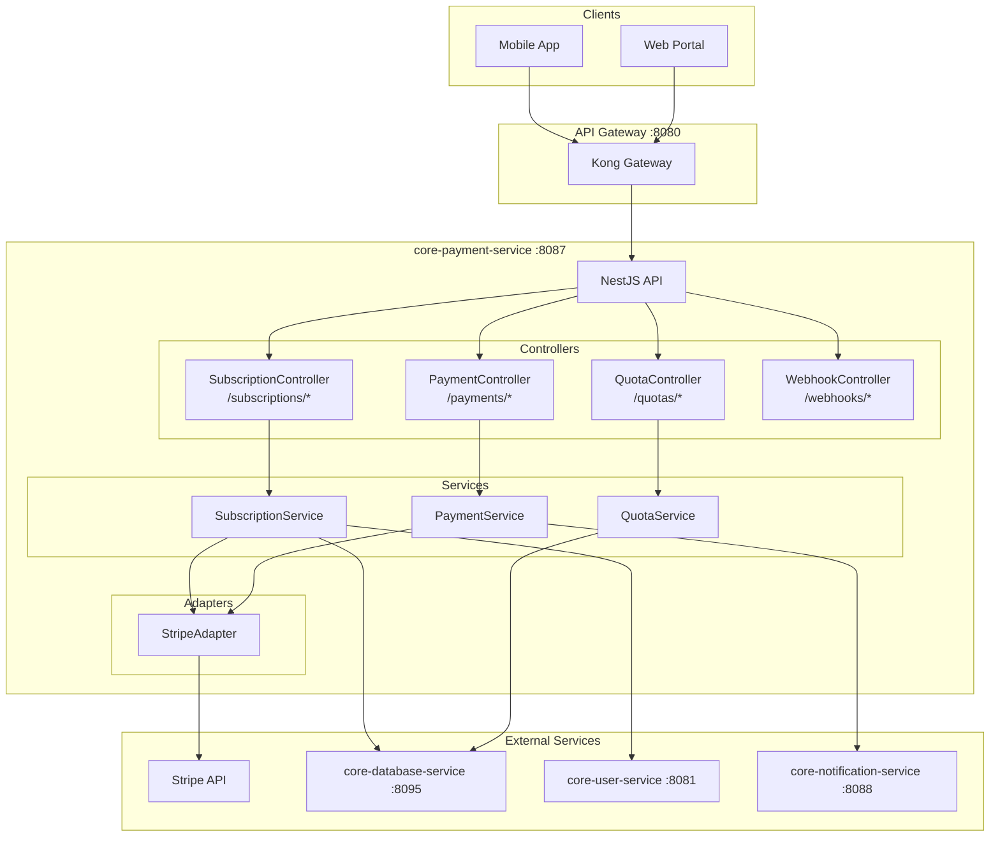
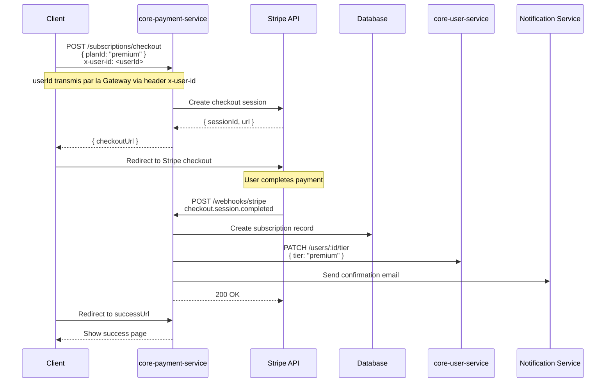
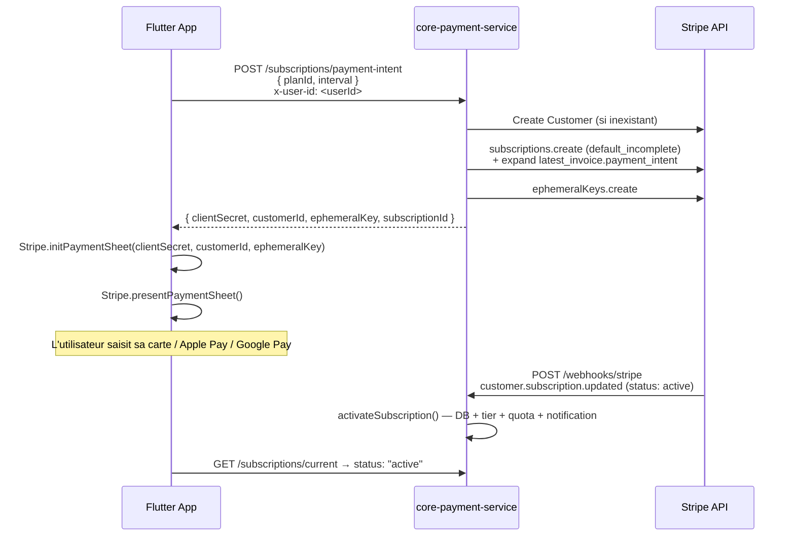

# core-payment-service

[](https://github.com/FlorianBernier/core-payment-service)
[](https://github.com/FlorianBernier/core-payment-service)
[](https://github.com/FlorianBernier/core-payment-service)
[](./LICENSE)

Microservice de gestion des paiements, abonnements et quotas pour la plateforme VisioBook.

> **Authentification** : L'identite utilisateur est transmise par l'upstream (Gateway)
> via le header `x-user-id`. Ce service ne valide aucun token — il utilise directement
> le `userId` recu pour toutes les operations metier.

## Architecture



## Table des matieres

- [Informations generales](#informations-generales)
- [Quick Start](#quick-start)
- [Architecture](#architecture-1)
- [API Endpoints](#api-endpoints)
- [Configuration](#configuration)
- [Integration Stripe](#integration-stripe)
- [Communication Inter-services](#communication-inter-services)
- [Tests](#tests)
- [Deploiement](#deploiement)
- [Monitoring](#monitoring)
- [Documentation](#documentation)
- [Contributing](#contributing)
- [License](#license)

## Informations generales

| Propriete | Valeur |
|-----------|--------|
| **Repository** | core-payment-service |
| **Port** | 8087 |
| **Stack** | Node.js / NestJS |
| **Phase** | 6 - Services Complementaires |
| **Priorite** | Post-MVP (monetisation) |

### Flows/Journeys concernes

| Flow | Role | Responsabilite |
|------|------|----------------|
| Flow Premium | Owner | Gestion abonnements |
| Flow Quota | Owner | Verification/consommation credits |

## Quick Start

### Prerequis

- Node.js >= 18.x
- npm >= 9.x
- Docker & Docker Compose
- Compte Stripe (mode test)

### Installation

```bash
# Cloner le repository
git clone https://github.com/FlorianBernier/core-payment-service.git
cd core-payment-service

# Installer les dependances
npm install

# Copier le fichier d'environnement
cp .env.example .env

# Configurer les variables d'environnement (voir section Configuration)
```

### Lancement en developpement

```bash
# Demarrer les services dependants (PostgreSQL, Redis)
docker-compose up -d

# Lancer en mode developpement
npm run start:dev
```

### Lancement avec Docker

```bash
# Build et run
docker-compose -f docker-compose.yml -f docker-compose.dev.yml up --build
```

## Architecture

### Structure des dossiers

```
core-payment-service/
├── src/
│   ├── controllers/          # Controllers API REST
│   │   ├── subscription.controller.ts
│   │   ├── payment.controller.ts
│   │   ├── quota.controller.ts
│   │   └── webhook.controller.ts
│   ├── services/             # Logique metier
│   │   ├── subscription.service.ts
│   │   ├── payment.service.ts
│   │   └── quota.service.ts
│   ├── adapters/             # Integrations externes
│   │   └── stripe.adapter.ts
│   ├── dto/                  # Data Transfer Objects
│   ├── entities/             # Entites de base de donnees
│   ├── guards/               # Guards d'authentification
│   ├── middleware/           # Middlewares
│   ├── config/               # Configuration
│   ├── utils/                # Utilitaires
│   └── main.ts               # Point d'entree
├── tests/
│   ├── unit/                 # Tests unitaires
│   ├── integration/          # Tests d'integration
│   └── mocks/                # Mocks pour tests
├── docker/
│   └── Dockerfile            # Image de production
├── k8s/                      # Configuration Kubernetes
└── docs/                     # Documentation
```

### Modules principaux

| Module | Description |
|--------|-------------|
| **SubscriptionModule** | Gestion des abonnements (creation, upgrade, downgrade, annulation) |
| **PaymentModule** | Traitement des paiements via Stripe |
| **QuotaModule** | Gestion des quotas utilisateur (generations, stockage) |
| **WebhookModule** | Reception et traitement des webhooks Stripe |

### Diagramme de flux: Checkout Stripe



## API Endpoints

### SubscriptionController (`/api/v1/subscriptions`)

| Methode | Endpoint | Description | Auth |
|---------|----------|-------------|------|
| GET | `/plans` | Liste des plans disponibles | Non |
| GET | `/current` | Abonnement actuel | x-user-id |
| POST | `/checkout` | Creer session checkout (web, redirect Stripe) | x-user-id |
| POST | `/payment-intent` | PaymentIntent pour Payment Sheet natif (flutter_stripe) | x-user-id |
| POST | `/cancel` | Annuler abonnement | x-user-id |
| POST | `/upgrade` | Upgrade plan | x-user-id |
| POST | `/downgrade` | Downgrade plan | x-user-id |

### QuotaController (`/api/v1/quotas`)

| Methode | Endpoint | Description | Auth |
|---------|----------|-------------|------|
| GET | `/` | Quotas utilisateur | x-user-id |
| POST | `/consume` | Consommer quota | Service-only |
| POST | `/reset` | Reset quotas (admin) | Admin |

### WebhookController (`/api/v1/webhooks`)

| Methode | Endpoint | Description | Auth |
|---------|----------|-------------|------|
| POST | `/stripe` | Webhook Stripe | Stripe signature |

### Interfaces TypeScript

```typescript
// Plans
interface Plan {
  id: string;
  name: 'free' | 'premium' | 'enterprise';
  price: number;
  currency: string;
  interval: 'month' | 'year';
  features: PlanFeature[];
  limits: PlanLimits;
}

interface PlanLimits {
  generationsPerMonth: number;
  storageGB: number;
  maxProjectSize: number;
  exportQuality: '720p' | '1080p' | '4k';
  watermark: boolean;
}

// Quotas
interface UserQuota {
  userId: string;
  plan: string;
  generations: {
    used: number;
    limit: number;
    resetDate: string;
  };
  storage: {
    used: number;
    limit: number;
  };
}

// Checkout
interface CheckoutRequest {
  planId: string;
  successUrl: string;
  cancelUrl: string;
}

interface CheckoutResponse {
  sessionId: string;
  checkoutUrl: string;
}
```

## Configuration

### Variables d'environnement

```bash
# Application
NODE_ENV=development
PORT=8087
API_PREFIX=/api/v1

# Database (via core-database-service)
DATABASE_SERVICE_URL=http://core-database-service:8095

# Stripe
STRIPE_SECRET_KEY=sk_test_xxxxx
STRIPE_PUBLISHABLE_KEY=pk_test_xxxxx
STRIPE_WEBHOOK_SECRET=whsec_xxxxx

# Services internes
USER_SERVICE_URL=http://core-user-service:8081
NOTIFICATION_SERVICE_URL=http://core-notification-service:8088

# Auth
# Pas de JWT_SECRET : la Gateway valide le token en amont et transmet
# l'identite utilisateur via le header x-user-id.

# Redis (cache)
REDIS_HOST=localhost
REDIS_PORT=6379

# Logging
LOG_LEVEL=info
```

### Configuration des plans

```typescript
// src/config/plans.config.ts
export const plans = [
  {
    id: 'free',
    name: 'Free',
    stripePriceId: null,
    price: 0,
    limits: {
      generationsPerMonth: 3,
      storageGB: 1,
      maxProjectSize: 5,
      exportQuality: '720p',
      watermark: true,
    },
  },
  {
    id: 'premium',
    name: 'Premium',
    stripePriceId: 'price_premium_monthly',
    price: 9.99,
    limits: {
      generationsPerMonth: 50,
      storageGB: 10,
      maxProjectSize: 50,
      exportQuality: '1080p',
      watermark: false,
    },
  },
  {
    id: 'enterprise',
    name: 'Enterprise',
    stripePriceId: 'price_enterprise_monthly',
    price: 29.99,
    limits: {
      generationsPerMonth: -1, // Illimite
      storageGB: 100,
      maxProjectSize: 200,
      exportQuality: '4k',
      watermark: false,
    },
  },
];
```

## Integration Stripe

### Flux Payment Sheet natif (flutter_stripe)

Parcours recommandé pour l'application mobile — aucune redirection externe, expérience 100% in-app avec Apple Pay / Google Pay / carte via la Payment Sheet de flutter_stripe.



**Ce que Flutter doit faire avec la réponse :**

```dart
// 1. Initialiser la Payment Sheet
await Stripe.instance.initPaymentSheet(
  paymentSheetData: SetupPaymentSheetParameters(
    paymentIntentClientSecret: response.clientSecret,
    customerEphemeralKeySecret: response.ephemeralKey,
    customerId: response.customerId,
    merchantDisplayName: 'VisioBook',
  ),
);

// 2. Afficher la Payment Sheet
await Stripe.instance.presentPaymentSheet();

// 3. Attendre que le webhook active la subscription (1-2s)
// puis interroger GET /subscriptions/current pour confirmer status: "active"
```

**Interface TypeScript de l'endpoint :**

```typescript
// POST /api/v1/subscriptions/payment-intent
interface PaymentIntentRequest {
  planId: 'premium' | 'enterprise';
  interval?: 'month' | 'year'; // défaut: 'month'
}

interface PaymentIntentResponse {
  clientSecret: string;    // paymentIntentClientSecret pour flutter_stripe
  customerId: string;      // customerId pour flutter_stripe
  ephemeralKey: string;    // customerEphemeralKeySecret pour flutter_stripe
  subscriptionId: string;  // sub_xxx (statut incomplete, activé via webhook)
}
```

### Flux Checkout Stripe (web, redirect)

Pour le portail web — redirige vers une page Stripe hébergée. Voir [diagramme Checkout](#diagramme-de-flux-checkout-stripe).

### Webhooks supportes

| Event | Description | Action |
|-------|-------------|--------|
| `checkout.session.completed` | Paiement reussi | Creer abonnement |
| `customer.subscription.created` | Nouvel abonnement | Activer plan |
| `customer.subscription.updated` | Modification | Mettre a jour plan |
| `customer.subscription.deleted` | Annulation | Desactiver plan |
| `invoice.paid` | Facture payee | Log transaction |
| `invoice.payment_failed` | Echec paiement | Notifier utilisateur |

### Configuration Stripe Dashboard

1. Creer les produits et prix dans le Stripe Dashboard
2. Configurer le webhook endpoint: `https://your-domain.com/api/v1/webhooks/stripe`
3. Selectionner les events a ecouter
4. Copier le webhook secret dans `STRIPE_WEBHOOK_SECRET`

### Mock Stripe pour tests

```typescript
// tests/mocks/stripe.mock.ts
export const mockStripe = {
  checkout: {
    sessions: {
      create: jest.fn().mockResolvedValue({
        id: 'cs_test_123',
        url: 'https://checkout.stripe.com/test',
      }),
    },
  },
  subscriptions: {
    retrieve: jest.fn().mockResolvedValue({
      id: 'sub_123',
      status: 'active',
      current_period_end: Date.now() / 1000 + 30 * 24 * 3600,
    }),
    cancel: jest.fn().mockResolvedValue({ status: 'canceled' }),
  },
  webhooks: {
    constructEvent: jest.fn().mockReturnValue({
      type: 'checkout.session.completed',
      data: { object: { subscription: 'sub_123' } },
    }),
  },
};
```

## Communication Inter-services

### Flux d'authentification

```
Upstream (Gateway) --> core-payment-service
                       Header: x-user-id: <userId>
                       |
                       +--> UserIdGuard extrait le userId du header
                            et l'injecte dans req.user
```

> **Note** : Ce service ne valide aucun token. L'upstream (Gateway) s'en charge
> et transmet l'identite utilisateur via le header `x-user-id`.
> Le `UserIdGuard` extrait ce header et l'injecte dans la requete — si le header
> est absent, une erreur 401 est retournee.

### Contrat core-user-service

Ce service appelle `core-user-service` uniquement pour les operations metier
(recuperer les infos utilisateur, mettre a jour le tier) — jamais pour l'authentification.

```typescript
// core-user-service GET /api/v1/users/:id
interface UserInfo {
  id: string;    // UUID de l'utilisateur
  email: string; // Email de l'utilisateur
  name?: string; // Nom (optionnel)
  tier: string;  // Plan actuel
}
```

Le `UserIdGuard` orchestre le flux d'authentification pour toutes les routes protegees :

1. Extraire le `userId` du header `x-user-id`
2. Injecter `{ userId }` dans `req.user`
3. Retourner HTTP 401 si le header est absent

### Appels sortants

| Service cible | Endpoint | Objectif |
|---------------|----------|----------|
| Stripe API | SDK | Traitement paiements |
| core-user-service | `GET /api/v1/users/:id` | Recuperation infos utilisateur |
| core-user-service | `PATCH /api/v1/users/:id/tier` | Mise a jour tier utilisateur |
| core-notification-service | `POST /api/v1/email/send` | Emails confirmation |
| core-database-service | `POST /api/v1/query` | Stockage transactions |

### Strategie de mock (developpement sans core-user-service)

Tant que `core-user-service` n'est pas disponible, activer le mock via la variable d'environnement :

```bash
# .env (developpement local)
USER_SERVICE_MOCK=true
```

Quand `USER_SERVICE_MOCK=true`, le module injecte `UserServiceMock` a la place de
`UserServiceClient` — sans modifier la logique metier ni les tests.

```typescript
// tests/mocks/user-service.mock.ts
// Egalement utilise en developpement local quand USER_SERVICE_MOCK=true
export const mockUserServiceClient = {
  getUserById: jest.fn().mockResolvedValue({
    id: 'user-123',
    email: 'test@visiobook.com',
    name: 'Test User',
    tier: 'free',
  }),
  updateUserTier: jest.fn().mockResolvedValue(undefined),
};
```

Ce mock couvre tous les tests unitaires, d'integration, et le developpement local
jusqu'a ce que `core-user-service` soit disponible et stable.

### Appels entrants

| Service source | Endpoint appele | Objectif |
|----------------|-----------------|----------|
| mobile-app | `POST /subscriptions/checkout` | Checkout |
| web-user-portal | `POST /subscriptions/checkout` | Checkout |
| core-project-service | `POST /quotas/consume` | Consommer quota |

## Tests

### Lancer les tests

```bash
# Tests unitaires
npm run test

# Tests unitaires avec couverture
npm run test:cov

# Tests d'integration
npm run test:e2e

# Mode watch
npm run test:watch
```

### Structure des tests

```
tests/
├── unit/
│   ├── adapters/
│   │   └── stripe.adapter.spec.ts      ✅ 10 tests (Stripe SDK mocké)
│   ├── guards/
│   │   └── user-id.guard.spec.ts       ✅ 4 tests
│   ├── services/
│   │   ├── subscription.service.spec.ts ✅
│   │   ├── webhook.service.spec.ts      ✅
│   │   └── quota.service.spec.ts        ✅
│   └── controllers/
│       ├── subscription.controller.spec.ts ✅
│       └── quota.controller.spec.ts        ✅
├── integration/                         ⏳ à faire
│   ├── subscription.e2e-spec.ts
│   ├── webhook.e2e-spec.ts
│   └── quota.e2e-spec.ts
└── mocks/
    ├── stripe.mock.ts
    ├── database.mock.ts
    ├── user-service.mock.ts
    └── notification.mock.ts
```

### Lancer un fichier de test spécifique

```bash
# Un seul fichier
npm test -- --testPathPattern="stripe.adapter"

# Plusieurs fichiers
npm test -- --testPathPattern="stripe.adapter|user-id"

# Tous les tests unitaires avec couverture
npm run test:cov
```

## Deploiement

### Docker

```dockerfile
# docker/Dockerfile
FROM node:18-alpine AS builder
WORKDIR /app
COPY package*.json ./
RUN npm ci
COPY . .
RUN npm run build

FROM node:18-alpine AS runner
WORKDIR /app
RUN addgroup -g 1001 -S nodejs && adduser -S nestjs -u 1001
COPY --from=builder /app/dist ./dist
COPY --from=builder /app/node_modules ./node_modules
COPY --from=builder /app/package.json ./
USER nestjs
EXPOSE 8087
CMD ["node", "dist/main.js"]
```

### Kubernetes

```yaml
# k8s/deployment.yaml
apiVersion: apps/v1
kind: Deployment
metadata:
  name: core-payment-service
  namespace: visiobook
spec:
  replicas: 2
  selector:
    matchLabels:
      app: core-payment-service
  template:
    metadata:
      labels:
        app: core-payment-service
    spec:
      containers:
        - name: core-payment-service
          image: core-payment-service:latest
          ports:
            - containerPort: 8087
          env:
            - name: NODE_ENV
              value: production
          resources:
            requests:
              cpu: "250m"
              memory: "256Mi"
            limits:
              cpu: "500m"
              memory: "512Mi"
          readinessProbe:
            httpGet:
              path: /health/ready
              port: 8087
            initialDelaySeconds: 5
            periodSeconds: 10
          livenessProbe:
            httpGet:
              path: /health
              port: 8087
            initialDelaySeconds: 15
            periodSeconds: 20
```

## Monitoring

### Health Checks

| Endpoint | Description |
|----------|-------------|
| `GET /health` | Etat general du service |
| `GET /health/ready` | Pret a recevoir du trafic |
| `GET /metrics` | Metriques Prometheus |

### Metriques de succes

| Metrique | Objectif | Description |
|----------|----------|-------------|
| Conversion rate | > 5% | Free -> Premium |
| Payment success | > 99% | Taux succes paiements |
| Churn rate | < 5%/mois | Annulations |
| MRR growth | > 10%/mois | Croissance revenus |
| Response time P95 | < 200ms | Temps de reponse |

### Metriques Prometheus

```typescript
// Exemples de metriques exposees
payment_checkout_total{status="success|failed"}
payment_webhook_received_total{event="checkout.session.completed|..."}
subscription_active_total{plan="free|premium|enterprise"}
quota_consumption_total{type="generation|storage"}
```

## Documentation

- [Documentation microservice detaillee](./docs/microservices/core-payment-service.md)
- [Guide developpeur VisioBook](./docs/dev/guide-developpeur.md)
- [Architecture globale](./docs/microservices/00-overview.md)
- [User Stories](./docs/epics/user_stories.md)
- [API Swagger](http://localhost:8087/api/docs) (en developpement)

## Contributing

Voir [CONTRIBUTING.md](./CONTRIBUTING.md) pour les guidelines de contribution.

### Workflow de developpement

1. Creer une branche depuis `dev`
2. Implementer la feature/fix
3. Ecrire les tests (couverture > 80%)
4. Soumettre une Pull Request
5. Code review et merge

## License

MIT License - Voir [LICENSE](./LICENSE) pour plus de details.

---

**Maintenu par**: Equipe VisioBook
**Contact**: team@visiobook.com
**Version**: 0.1.0
